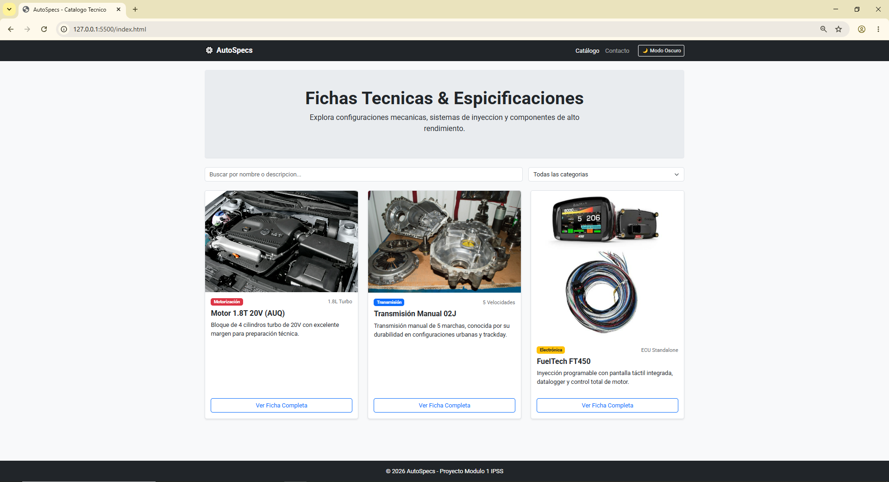
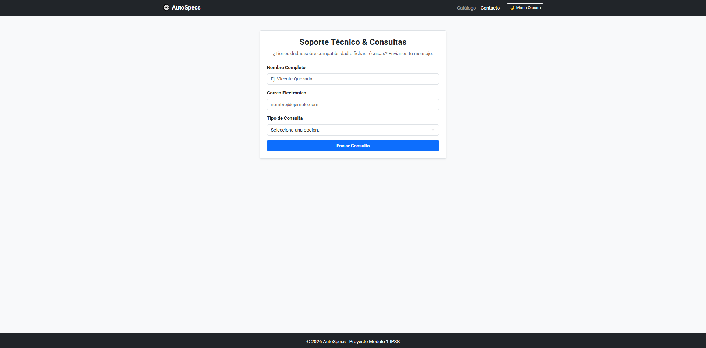

# AutoSpecs - Catálogo Técnico Automotriz

> Proyecto del Módulo 1 — HTML + CSS + JS · Diplomado Fullstack IPSS

## Integrantes

- Vicente Quezada (Trabajo realizado de forma individual)

## Descripción

Plataforma y catálogo web de especificaciones técnicas automotrices: permite consultar fichas detalladas, configuraciones mecánicas y componentes de alto rendimiento (como motores 1.8T, transmisiones manuales y sistemas de inyección programable Standalone), ofreciendo consumo dinámico de datos, búsqueda interactiva, filtrado por categorías y tematización persistente en modo oscuro.

## Vista del proyecto 
### Vista Principal (Home)



### Vista de Contacto


## Evolutivos Implementados (E1 - E4)

* **E1 — Maquetación y Estructura Base:**
  * Maquetación responsive con HTML5 semántico (`<header>`, `<main>`, `<section>`, `<article>`, `<footer>`) y Bootstrap 5.3.
  * Formulario de contacto con validación visual y ventana modal para fichas técnicas.
  * Control de versiones estructurado mediante ramas `feature/*` y Pull Requests en GitHub.

* **E2 — Consumo Asíncrono de API Externa:**
  * Consumo modular desde `js/api.js` utilizando `fetch` y control de errores con `try/catch`.
  * Normalización y homologación de datos externos con especificaciones técnicas en español.
  * Renderizado seguro en el DOM (creación de nodos nativos para prevención de XSS) y estados visuales de carga (*loading spinner*).

* **E3 — Búsqueda y Filtrado en Tiempo Real:**
  * Módulo dedicado `js/filtro.js` para filtrado combinado (coincidencia de texto y selector de categoría).
  * Manejo reactivo del estado "Sin resultados encontrados" con diseño adaptativo.

* **E4 — Persistencia de Preferencias del Usuario:**
  * Módulo `js/storage.js` para conmutar entre Modo Oscuro y Modo Claro.
  * Persistencia del tema mediante `localStorage` para mantener la preferencia tras recargar la página.

## Páginas

### Home (index.html)
"Fichas Técnicas & Especificaciones Automotrices"
Presenta la grilla dinámica de vehículos y componentes, con buscador en tiempo real por nombre/descripción y selector de categorías.

### Catálogo / Muestra de Productos
Grilla responsive basada en tarjetas de Bootstrap 5 con:
- Categorías: Vehículos, Motorización, Transmisión y Electrónica.
- Buscador dinámico por texto en tiempo real.
- Ventana modal interactiva para ver la ficha técnica detallada de cada componente.

### Contacto (contacto.html)
Formulario de soporte técnico y consultas de compatibilidad con validación nativa de HTML5/Bootstrap y feedback dinámico con JavaScript.

## Cómo correr localmente

El proyecto no requiere dependencias externas ni compiladores:
1. `git clone https://github.com/VixoVixey/autospecs-catalog.git`
2. `cd autospecs-catalog`
3. Abre el archivo `index.html` con un servidor local:
   - **VS Code**: Clic derecho sobre `index.html` → **Open with Live Server**.

## 📁 Estructura del proyecto

```text
autospecs-catalog/
├── css/
│   └── custom.css          # Variables CSS, overrides para dark mode y layout
├── js/
│   ├── api.js              # Consumo de API externa (DummyJSON) y homologación de datos
│   ├── filtro.js           # Lógica de filtrado en tiempo real y mensaje sin coincidencias
│   ├── storage.js          # Control y persistencia del tema oscuro en localStorage
│   └── main.js             # Punto de entrada, renderizado de cards, modal y formulario
├── img/                    # Capturas y recursos gráficos
├── index.html              # Vista principal del catálogo
├── contacto.html           # Vista del formulario de contacto
└── .gitignore              # Archivos y carpetas excluidas de Git.
```


## Librerías y Tecnologías utilizadas

- **HTML5 Semántico:** Uso de etiquetas estructurales (`<header>`, `<main>`, `<section>`, `<article>`, `<form>`, `<footer>`).
- **Bootstrap 5 (v5.3.3):** Utilizado para el sistema de grillas responsive, Navbar, tarjetas (`cards`), modales y estilos base del formulario.
- **Google Fonts:** Tipografía personalizada (*Roboto*).
- **Vanilla JavaScript:** Control total del DOM y manejo de eventos sin frameworks externos.
- **LocalStorage API:** Almacenamiento local de preferencias de interfaz.